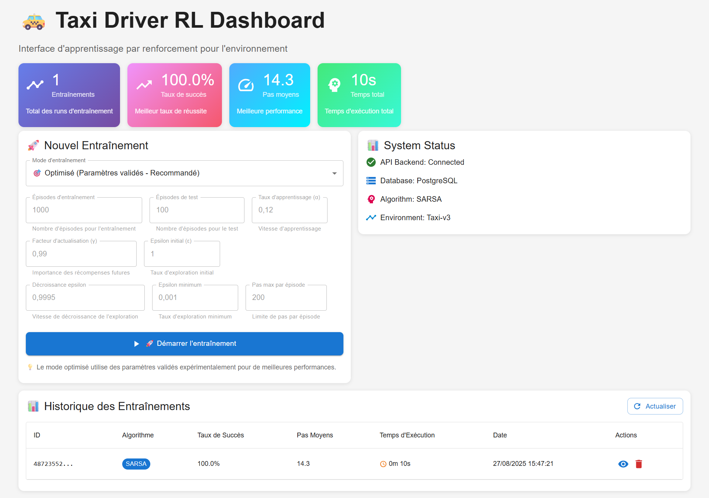
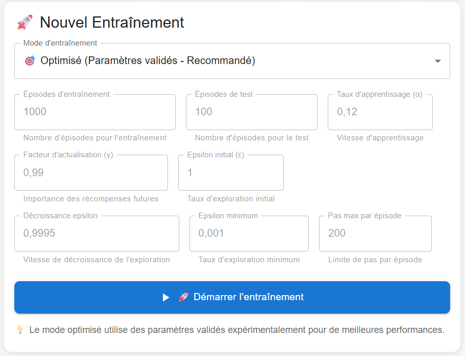
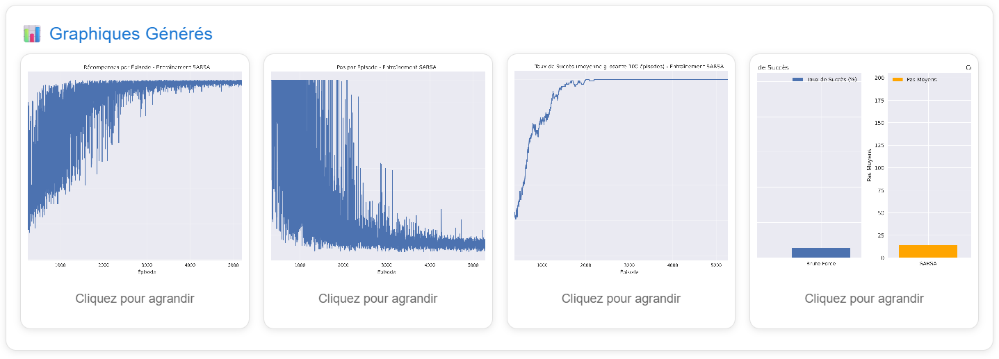
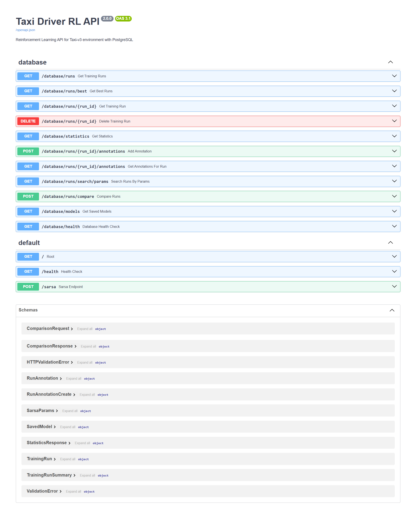
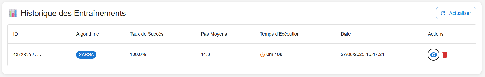

# 🚕 Taxi Driver - Reinforcement Learning Project

[](https://www.python.org/downloads/)
[](https://fastapi.tiangolo.com/)
[](https://reactjs.org/)
[](https://www.postgresql.org/)
[](https://docs.docker.com/compose/)

Un projet complet de **Reinforcement Learning** utilisant l'algorithme **SARSA** pour résoudre l'environnement **Taxi-v3** de Gymnasium. Le projet inclut une API FastAPI, une interface React moderne, et une base de données PostgreSQL pour le suivi des performances.

## 🎯 Fonctionnalités Principales

### 🤖 Algorithmes RL

- **SARSA (State-Action-Reward-State-Action)** avec paramètres optimisés
- **Comparaison avec Brute Force** pour évaluer les performances
- **Métriques avancées** : stabilité d'apprentissage, amélioration vs baseline

### 📊 Interface Utilisateur

- **Dashboard React** avec Material-UI
- **Visualisations en temps réel** des entraînements
- **Historique complet** des runs d'entraînement
- **Statistiques détaillées** et graphiques de performance



### 🗄️ Base de Données

- **PostgreSQL** avec JSONB pour les métriques complexes
- **Sauvegarde automatique** de tous les runs
- **Recherche avancée** par paramètres et performances
- **Annotations** et commentaires sur les runs

### 🚀 API REST

- **FastAPI** avec documentation automatique
- **Endpoints complets** pour l'entraînement et l'analyse
- **Validation Pydantic** des paramètres
- **CORS** configuré pour le frontend

## 🏗️ Architecture

```
taxi-driver/
├── app/                          # Backend FastAPI
│   ├── api/
│   │   ├── main.py              # Point d'entrée API
│   │   ├── database.py          # Configuration DB
│   │   ├── models.py            # Modèles SQLAlchemy
│   │   ├── routes/              # Routes API
│   │   ├── schemas/             # Schémas Pydantic
│   │   └── services/            # Services métier
│   └── ml/                      # Algorithmes ML
├── frontend/                     # Interface React
│   ├── src/
│   │   ├── components/          # Composants React
│   │   ├── services/            # Services API
│   │   └── types/               # Types TypeScript
│   └── package.json
├── infrastructure/               # Configuration Docker
│   └── docker/
├── data/                         # Données et résultats
│   ├── results/                 # Résultats d'entraînement
│   ├── models/                  # Modèles sauvegardés
│   └── logs/                    # Logs système
├── docs/                         # Documentation
└── tests/                        # Tests unitaires et intégration
```

## 🚀 Démarrage Rapide

### Prérequis

- **Docker** et **Docker Compose**
- **Node.js 16+** (pour le frontend en développement)

### 1. Cloner le projet

```bash
git clone https://github.com/cheikh-mbacke/taxi-driver.git
cd taxi-driver
```

### 2. Démarrage avec Docker (Recommandé)

```bash
# Démarrage rapide
./start-dev.sh
```

### 3. Accès aux services

- **API** : http://localhost:8000
- **Documentation API** : http://localhost:8000/docs
- **Base de données** : localhost:5432

### 4. Démarrage du Frontend (Optionnel)

Le frontend React n'est pas dockerisé et doit être démarré manuellement :

```bash
cd frontend
npm install
npm run dev
```

Puis accéder à : http://localhost:3000

### 5. Premier entraînement

Une fois le frontend démarré, ouvrir http://localhost:3000 et cliquer sur "Démarrer l'entraînement" pour lancer votre premier entraînement SARSA.



**Note** : L'interface web permet de configurer facilement tous les paramètres d'entraînement sans avoir besoin de commandes terminal.

## 📚 Documentation Détaillée

### 🎯 Algorithmes

#### SARSA Optimisé

L'algorithme SARSA utilise des paramètres validés expérimentalement pour atteindre des performances optimales :

```python
# Paramètres optimisés (mode="optimized")
alpha = 0.12           # Taux d'apprentissage optimal
gamma = 0.99           # Facteur d'actualisation
eps = 1.0              # Exploration complète initiale
eps_decay = 0.9995     # Décroissance ultra-progressive
eps_min = 0.001        # Exploration ultra-fine
training_runs = 6000   # Patience extrême
test_episodes = 250    # Validation robuste
```

**Performances moyennes** :

- **Taux de succès** : 100%
- **Pas moyens** : 13.1
- **Temps d'entraînement** : ~2-3 minutes

#### Métriques Collectées

- **Métriques d'entraînement** : récompenses, pas, erreurs TD
- **Métriques de test** : taux de succès, pas moyens
- **Métriques système** : CPU, RAM, temps d'exécution
- **Stabilité d'apprentissage** : variance Q-table, convergence
- **Comparaison brute force** : amélioration, efficacité



### 🗄️ Base de Données

#### Tables Principales

- **`training_runs`** : Runs d'entraînement avec métriques JSONB
- **`saved_models`** : Modèles sauvegardés avec métadonnées
- **`run_annotations`** : Annotations et commentaires
- **`users`** : Utilisateurs (pour extensibilité future)

#### Requêtes Utiles

```sql
-- Statistiques par algorithme
SELECT algorithm, COUNT(*), AVG((test_metrics->>'success_rate')::FLOAT)
FROM training_runs GROUP BY algorithm;

-- Meilleurs runs
SELECT * FROM training_runs
WHERE (test_metrics->>'success_rate')::FLOAT > 0.95
ORDER BY (test_metrics->>'avg_steps')::FLOAT ASC;
```

### 🔌 API Endpoints

#### Entraînement

```bash
POST /sarsa
{
  "mode": "optimized",
  "test_episodes": 250,
  "training_runs": 6000
}
```

#### Base de Données

```bash
GET /database/runs              # Liste des runs
GET /database/statistics        # Statistiques globales
GET /database/runs/{id}         # Détails d'un run
DELETE /database/runs/{id}      # Supprimer un run
```

#### Santé

```bash
GET /health                     # Statut de l'API
GET /database/health            # Statut de la DB
```



## 🛠️ Développement

### Scripts de Démarrage

```bash
# Démarrage rapide (recommandé)
./start-dev.sh

# Démarrage avec rebuild complet
./start-rebuild.sh

# Démarrage ultra-rapide
./start-fast.sh
```

## 📊 Interface Utilisateur

### Composants Principaux

- **Dashboard** : Vue d'ensemble avec statistiques
- **TrainingForm** : Configuration des entraînements
- **RunsTable** : Historique des runs avec actions
- **StatisticsCards** : Métriques en temps réel



### Technologies Frontend

- **React 19.1** avec hooks et composants fonctionnels
- **TypeScript** pour la sécurité des types
- **Material-UI** pour l'interface utilisateur
- **Axios** pour les appels API
- **Vite** pour le build et le développement

## 🔧 Configuration

### Docker Compose

Le projet utilise Docker Compose avec 2 services :

- **postgres** : Base de données PostgreSQL
- **taxi-driver-api** : API FastAPI

**Note** : Le frontend React n'est pas dockerisé et doit être démarré manuellement en mode développement.

## 📈 Performance et Optimisations

### Optimisations Système

- **BuildKit** pour les builds Docker
- **Volumes persistants** pour les données
- **Health checks** pour tous les services
- **Cache pip** pour les dépendances Python

## 📞 Support

Pour toute question ou problème :

- **Email** : mbackechikhouna7@gmail.com
- **Issues** : Créer une issue sur GitHub
- **Documentation** : Consulter `/docs/`
- **API** : http://localhost:8000/docs (Swagger)

---

**🚕 Taxi Driver RL** - Apprentissage par renforcement moderne et performant !
